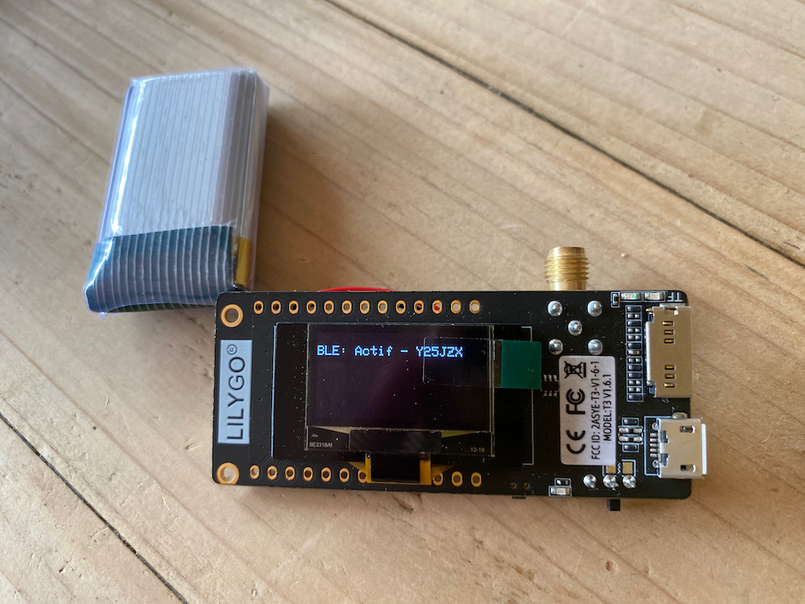
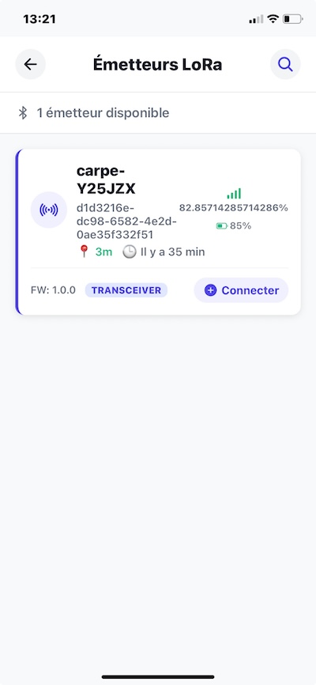
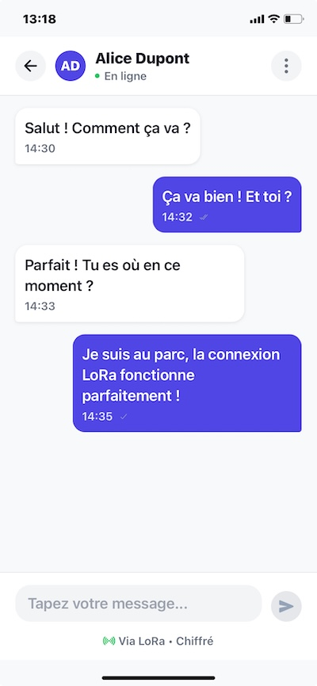

# 🐟 Carpe

Carpe is an experiment in building a **decentralized messaging system** using LoRa and BLE.  
It’s not about selling, scaling or shipping fast.  
It’s about **exploration, autonomy, and curiosity**.

---

## Hey, stop — what is LoRa?  

LoRa (short for *Long Range*) is a radio protocol designed to transmit **small amounts of digital data** over long distances using very little power.  

- It doesn’t need cell towers or Wi-Fi — just simple modules that talk directly to each other.  
- It’s optimized for resilience: low bandwidth, but strong range (several kilometers depending on the environment).  
- Perfect for building **peer-to-peer communication networks** without relying on centralized infrastructure.  

👉 Want to dive deeper? Check out [LoRa explained](https://www.thethingsnetwork.org/docs/lorawan/what-is-lorawan/).  

📡 **Carpe currently uses LoRa in peer-to-peer mode** — modules communicate directly without gateways or servers.  

---

## 💡 Motivation

Why not just use a walkie-talkie?  

The most decentralized communication device already exists: the walkie-talkie. It's simple, reliable, and often the best solution.  
I have two excellent walkies, and I rarely carry them with me — only when I know I'll really need them, which is almost never 😄  

But what device do we actually carry everywhere, on every trip?  
Our phone.  

And that’s where the idea came:  
*What if we had a small, discreet module that could turn our phone into a transmitter/receiver, extending its reach without relying on the Internet or central servers?*  

Carpe is the experiment born from this question — a way to explore peer-to-peer, off-grid communication, while staying practical and portable.

---

## 🌍 What is this?

Carpe is a playground for ideas and a vision for the future:

- Eliminate dependencies on the cloud or central authorities  
- Connect people directly using peer-to-peer communication  
- Rely on open hardware, not locked-in systems  
- A tool everyone can build, adapt, and experiment with  
  

---

## Why "Carpe"?  

The name comes from *Carpe diem* — “seize the day.”  
Here, it means **seizing autonomy** in the way we communicate.  

Carpe is not a finished product but an exploration:  
- A way to reclaim resilience in communication  
- An invitation to wander off the beaten path  
- A notebook in motion, where experiments come to life  

--

## 🛠️ Current Status

Work in progress — and fun! 🎉  
A minimal firmware is under development in [`amallo/carpe-module`](https://github.com/amallo/carpe-module).

---

## 🤔 Why?

Because the world needs **resilient, off-grid communication tools**.  
Because tinkering in the unknown feels alive.  
Because autonomy matters.

---

## 📖 Notes

- This repo will evolve slowly and openly.  
- Expect experiments, not guarantees.  
- Contributions, forks, and crazy ideas are welcome.  

---

## ✨ Motto

> “Exploration first. Outcome later.”

---

## 📱 Screenshots

